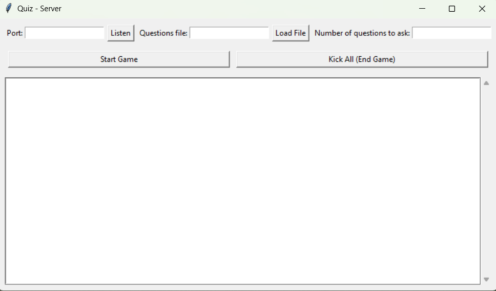
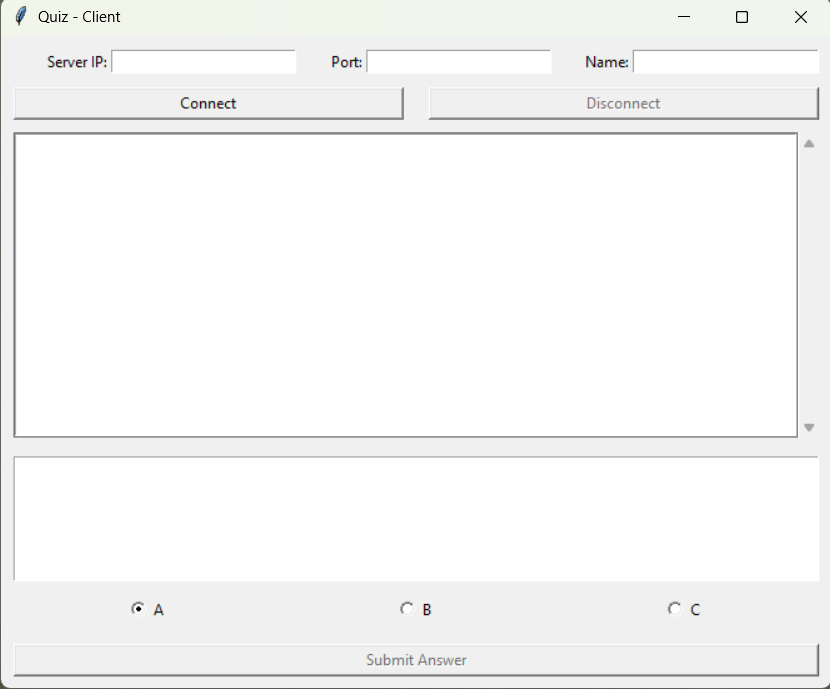

# Quiz Game — Multiplayer TCP Network Application

A real-time multiplayer quiz game built with Python, featuring a custom TCP protocol, threaded client handling, and GUI interfaces for both server and clients.


## Features

- **Client-Server Architecture** — Centralized server manages game state; multiple clients connect over TCP
- **Real-time Multiplayer** — Players compete simultaneously with live score updates
- **Custom Protocol** — Lightweight message format for efficient communication
- **Thread-Safe Scoring** — Mutex locks prevent race conditions when processing concurrent answers
- **Bonus System** — First correct answer earns bonus points equal to (number of players − 1)
- **Graceful Handling** — Supports mid-game disconnects, duplicate name rejection, and late join blocking

## Screenshots

<p align="center">
  
  
</p>

## Quick Start

### Prerequisites
- Python 3.8+
- Tkinter (included with most Python installations)

### Running the Server

```bash
python server_side.py
```

1. Enter a port number (e.g., `5000`)
2. Click **Listen**
3. Load a questions file (see format below)
4. Set number of questions to ask
5. Wait for clients to connect, then click **Start Game**

### Running a Client

```bash
python client_side.py
```

1. Enter server IP (e.g., `127.0.0.1` for localhost)
2. Enter port (must match server)
3. Enter your player name
4. Click **Connect**

## Questions File Format

Create a text file with questions in this format:

```
Question text here?
Choice A
Choice B
Choice C
A
```

Each question block consists of:
- Line 1: Question text
- Lines 2-4: Three answer choices
- Line 5: Correct answer (`A`, `B`, or `C`)

Separate questions with blank lines. Example file:

```
What is the capital of France?
Berlin
Paris
London
B

Which planet is closest to the Sun?
Venus
Mercury
Mars
B
```

## Protocol Specification

Communication uses a simple text-based protocol over TCP. Messages are newline-terminated with pipe-delimited fields.

### Server → Client Messages

| Type | Format | Description |
|------|--------|-------------|
| `ERROR` | `ERROR\|message` | Connection rejected or fatal error |
| `MSG` | `MSG\|message` | Informational message |
| `QUESTION` | `QUESTION\|text\|A\|B\|C\|idx\|total` | Question with choices and progress |
| `YOURRESULT` | `YOURRESULT\|message` | Personal result after answering |
| `SCORE` | `SCORE\|scoreboard` | Current standings (newlines as `\n`) |
| `GAMEOVER` | `GAMEOVER\|final_scoreboard` | Game ended, final rankings |

### Client → Server Messages

| Type | Format | Description |
|------|--------|-------------|
| (name) | `playername` | Sent immediately after connecting |
| `ANSWER` | `ANSWER\|A/B/C` | Player's answer submission |

## Architecture

```
┌─────────────────────────────────────────────────────────┐
│                      SERVER                             │
│  ┌─────────────┐  ┌─────────────┐  ┌─────────────────┐  │
│  │   Accept    │  │    Game     │  │  Answer Lock    │  │
│  │   Thread    │  │   Thread    │  │  (threading)    │  │
│  └─────────────┘  └─────────────┘  └─────────────────┘  │
│         │                │                  │           │
│         ▼                ▼                  ▼           │
│  ┌──────────────────────────────────────────────────┐   │
│  │              Shared State                        │   │
│  │  • clients_by_name: {name: socket}               │   │
│  │  • scores: {name: points}                        │   │
│  │  • current_answers: {name: answer}               │   │
│  └──────────────────────────────────────────────────┘   │
└─────────────────────────────────────────────────────────┘
                          │
                    TCP Sockets
                          │
        ┌─────────────────┼─────────────────┐
        ▼                 ▼                 ▼
   ┌─────────┐       ┌─────────┐       ┌─────────┐
   │ Client  │       │ Client  │       │ Client  │
   │  Alice  │       │   Bob   │       │ Charlie │
   └─────────┘       └─────────┘       └─────────┘
```

### Concurrency Model

- **Accept Thread**: Listens for new connections, validates names, spawns per-client handlers
- **Per-Client Threads**: Each client has a dedicated thread for receiving messages
- **Game Thread**: Orchestrates question flow, waits for all answers, triggers scoring
- **Answer Lock**: `threading.Lock()` protects shared answer state during concurrent submissions

## Scoring Rules

| Condition | Points |
|-----------|--------|
| Correct answer | +1 |
| First correct answer | +1 + (number of players − 1) bonus |
| Wrong answer | 0 |
| No answer | 0 |

## Project Structure

```
quiz-game-tcp/
├── server_side.py    # Server application with game logic
├── client_side.py    # Client application with player interface
├── questions.txt     # Example questions file (create your own)
├── screenshots/      # UI screenshots
│   ├── server.png
│   └── client.png
└── README.md
```

## License

MIT License — feel free to use, modify, and distribute.
